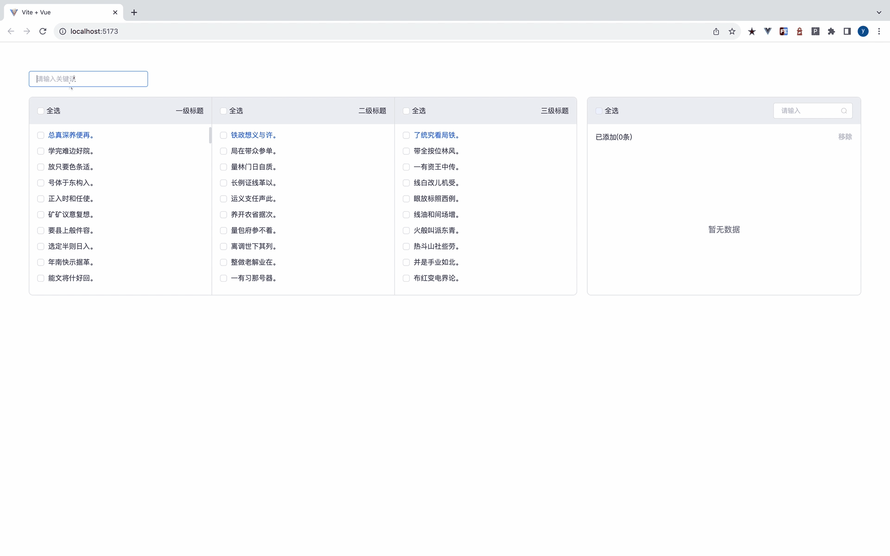

<p align="center">
    <h3 align="center">cascader-tree-select</h3>
    <br>
    <p align="center">
        <a href="https://www.npmjs.com/package/cascader-tree-select"></a>
        <a href="https://www.npmjs.com/package/@vueblocks/elp-cascader"></a>
        <a href="https://github.com/vueblocks/elp-cascader/stargazers"></a>
    </p>
    <p align="center">
        cascader-tree-select based on element-ui，vite and vue-virtual-scroller, combined with virtual list rendering level by level, supports full selection, and has high performance in large data volumes。
    </p>
</p>

# cascader-tree-select

> 基于`element-ui`和`vue-virtual-scroller`的全量级联树选择器，结合虚拟列表逐级渲染，支持全选，在较大数据量上也有较高的性能

### 全量数据前端搜索
> 搜索逻辑默认是如果当前节点包含搜索关键词，则它的子节点全部展示（如果仅仅想展示包含搜索关键词的选项可以设置ancestorHitShow为false）；如果当前节点不包含搜索关键词，但至少一个它的子节点包含搜索关键字，则当前节点展示


### 选中父节点，默认勾选全部子节点


### 各层级节点全选
> 第一级面板全选相当于所有节点全部选中，数万量级节点选中到页面渲染也能快速完成


## 快速安装使用

```
npm i cascader-tree-select --save
# or
yarn add cascader-tree-select
```

## 在main.js中引入, vue版本应在2.7以上

```javascript
import CascaderTreeSelect from 'cascader-tree-select'
import 'cascader-tree-select/src/style.less';
import 'element-ui/lib/theme-chalk/index.css'

Vue.use(CascaderTreeSelect)
```

## 请确保你的项目引入了'element-ui/lib/theme-chalk/index.css', 因为本组件依赖于 element-ui

## 在vue文件中直接使用

```html
<template>
  <cascader-tree-select
    :panelTitleList="['一级标题', '二级标题', '三级标题', '四级标题']"
    :options="_mock.array"
    @change="handleChange"
  ></cascader-tree-select>
</template>

<script setup>
  import Mock from 'mockjs'
  
  const _mock = Mock.mock({
    'array|100': [
      {
        label: '@csentence(6)',
        value: '@increment()',
        'children|10': [
          {
            label: '@csentence(6)',
            value: '@increment()',
            'children|10': [
              {
                label: '@csentence(6)',
                value: '@increment()',
              }
            ]
          }
        ]
      }
    ]
  })
  const handleChange = (result) => {
    console.log(result)
  }
</script>
```

## props

| 参数 | 说明                          | 类型      | 可选值                 | 默认值                      |
| --- |-----------------------------|---------|---------------------|--------------------------|
| value | 选中值                         | array   | -                   | []                       |
| options | 可选数据源                       | array   | -                   | []                       |
| needResultPanel | 是否需要结果面板                    | boolean | true/false          | true                     |
| resultLabelJoiner | 结果面板的选项名称拼接符                | string  | -                   | >                        |
| needSearch | 是否需要前端搜索                    | boolean | true/false          | true                     |
| placeholder | 搜索框的占位文本                    | string  | -                   | 请输入关键词                   |
| size | 搜索框的尺寸                      | string  | medium / small / mini | small                    |
| cascaderMaxLevel | 级联框的最大层级                    | number  | -                   | 2                        |
| panelTitleList | 级联面板的标题                     | array   | -                   | ['一级', '二级', '三级', '四级'] |
| ancestorHitShow | 当前节点命中搜索词，它的子节点无论是否命中搜索词均展示 | boolean | true/false                    | true                     |

## node字段

| 字段名称  | 说明             | 类型      | 可选值        | 默认值   |
|-------|----------|---------|------------|-------|
| uid   | 随机id   | string  | -          | -     |
| label | 当前节点的名称   | string  | -          | -     |
| value | 当前节点的值    | string  | -          | -     |
| level | 当前节点的层级   | number  | -          | -     |
| leaf  | 是否是叶节点    | boolean | true/false | false |
| disabled  | 是否被禁用     | boolean | true/false | false |
| parent  | 当前节点的父节点  | -       | -          | -     |
| children  | 当前节点的子节点  | -       | -          | -     |
| path  | 当前节点所在的各级菜单的value所组成的数组 | array   | -          | -     |
| pathName  | 当前节点所在的各级菜单的label所组成的数组 | array   | -          | -     |
| leafNodesNum  | 当前节点的子节点数量 | number  | -          | -     |
| checked  | 当前节点是否被选中 | boolean | true/false | false |
| indeterminate  | 当前节点是否有部门子节点被选中 | boolean | true/false | false |
| menuNodeShow  | 当前节点是否展示  | boolean | true/false | true  |
| colorDangerField  | 该字段值存在，节点标红 | string  | - | - |

## events

| 事件名称 | 说明 | 回调参数 |
|---|---|---|
|change|当选中节点变化时触发|选中节点的path组成的二维数组|

## Methods

| 方法名称   | 说明      | 参数         |
|--------|---------|------------|
| initMenuStore | 重置到初始状态 | 可选数据源，已选中值 |
